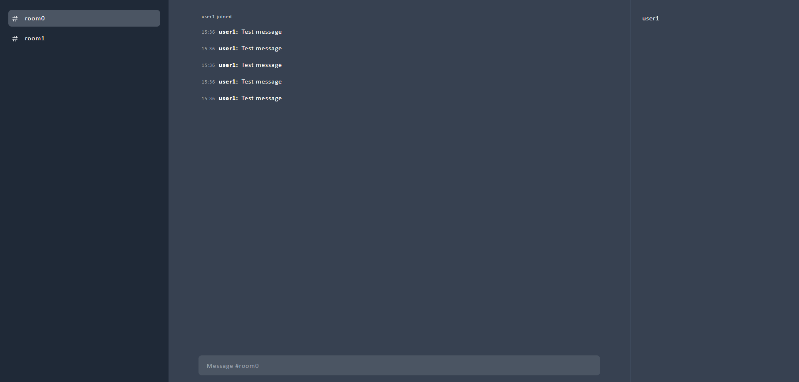

# SIMPLE CHAT

A simple chat server written in Go. Under the condition of 1 CPU and 128MB of memory, the server can handle 1000 concurrent connections, sending 23,000 messages per second.


In addition to the frontend page and connection testing, the project includes two types of servers: one that stores and broadcasts messages in memory, and another that uses Redis for storage and broadcasting.



## Folder

``` bash
├── server_memory # Server (using Memory)
├── server_redis  # Server (using Redis)
├── web           # Frontend page
└── ws-test       # Messages test
```

## Run

Open the webpage on local port 8000.

```bash
cd server_redis
docker compose up -d --build
```

## Messages Test

The test will establish 1000 connections and send messages.

```bash
cd ws-test
npm install -g artillery@latest
npx artillery run test.yaml
``` 

## Message Metrics

You can view the logs of the server, which display the average messages per second for the past one minute, five minutes, fifteen minutes, and overall.

```bash
docker logs -f --tail=0 simple-chat-redis-1
```

## Delete

```bash
cd server_redis
docker compose down
```